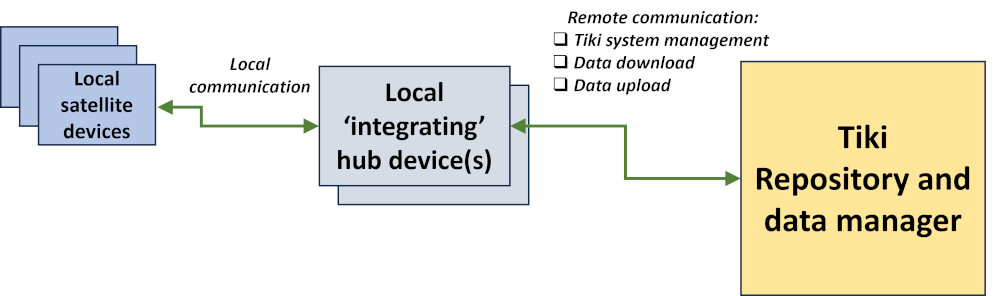

# Tiki IoT: code development
 The aim of this code and documentation maintenance repository is to support:
 - the way the open source <a href="https://tiki.org" target="_blank" >Tiki software</a>, an all-in-one Wiki+CMS+Groupware system, can be used as a central data repository and system management capability for an Internet of Things (IoT) deployment; and
 - to provide example code for the use of the TCP socket method for collecting data from local satellite devices.

The schematic below provides a very generic picture of how the various components of an overall ‘Tiki IoT’ system might be deployed.

## Documentation and example code
Within this repository:
 - the Tiki_API_C_code folder contains example 'C' code to support programmable access to the Tiki API by a local IoT 'integrating' hub device such as a Raspberry Pi or another small single board computer (SBC);
 - the Test_code_Python_templates folder provides a series of Python scripts, as templates, that can be easily configured to allow each of the Tiki API access 'C' functions to be tested from an 'integrating' hub device such as a Raspberry Pi or other SBC;
 - the TCP_socket_example_code folder provides example Python code, with extensive use of Python threads, for running a TCP socket server on an 'integrating' hub device such as a Raspberry Pi or other SBC. Using the TCP socket method to collect data from local satellite sensors is particularly useful where a local WiFi network can provide wide area coverage across a local non-public intranet. Example Python code is also provided for how a satellite sensor, managed by a small low cost Raspberry Pi Zero for example, can send data to a socket server on the hub device using a 'set' format for the data and a number of 'handshake' checks between the satellite and the socket server; plus finally
 - the documentation folder contains a PDF that provides some notes on the IoT context and the development/testing of the 'C' code.
 
It should be noted that all the 'C' code and Tiki API access 'template' files have a YYMMDD element in their file name which designates the release version, where the current versions are all 240403.

 More detail can be found on this IoT/Tiki development at <a href="https://onlinedevices.org.uk/Maker+projects+-+Internet+of+Things" target="_blank" >this link</a>

